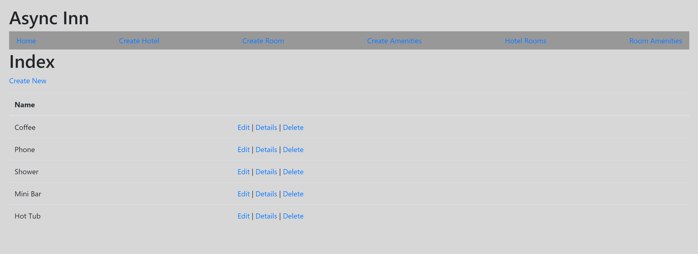

# AsyncInn
initial ASP.NET Core MVC application for a Hotel management system.
Technologies used: ASP.Net Core MVC, LINQ, System.IO Enitity framework, Dependency Injection.
# DB diagram

Create Hotel

Create Room

View Amenities

Home Page to greet the Hotel Admin. This page will also serve as a dashboard for the other locations of the site. 
Hotels page that will allow the admin to create and edit new or existing hotels 
Rooms page where the admin will be able to create or edit new or existing rooms 
Amenities page that will allow the admin to add to their list of existing amenities 
A page where they can link the Amenities to the rooms that currently exist 
A page where they can add existing rooms to hotels 
